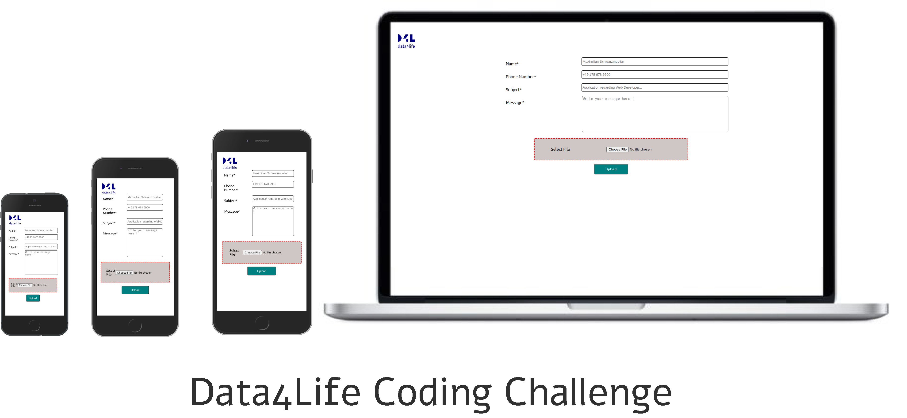

## About

This is an web application build for the purpose of participating in the Coding Challenge.

This web-app uses the following packages / Libraries
- Express
- NodeMailer
- PapaParse
- Express-handlebars

The challenge was 

> _"Please write a program in your preferred language that will send out emails to recipients from a huge list (1 Mio entries) in a performant way. You do not need to send real emails but just fake the email sending by waiting for half a second."_

Since not much technical information was provided in the challenge itself, following assumptions were made to try to pin point the task.

Assumptions :-
- free to choose any Framework/library/package. I chose to make a website using HTML/CSS/JS and some third party libraries/packages.
- 1 million email entries are to be sent. The list of 1 million email entries in the form of a .csv file format and only emails are present and no other data is present in the .csv file.
- Emails are to be sent in a performant way. So, worker threads can be used for parsing and sending the emails in an asynchronous manner so that main thread does not get unresponsive and all the load of parsing the email list and sending emails would be taken care of by other worker threads. For this, I used the inbuilt feature of Papaparse.js to enable worker thread. Vanilla JS can also be used but the motive here is to get the job done asap as it is not a production application.
- smtp server doesn't ban the account from which 1 million email entries are sent. For this, I assume I am allowed to use a fake SMTP service - "Ethereal" which receives all the emails meant for other email addresses but doesn't forward them to the real email addresses. It is a testing tool designed for developers. 

I've created the web-application which ACTUALLY sends out emails to multiple email addresses, stored in a .csv file (where the .csv file should only contains email, and should not contain other columns like name, address, house number, company etc. The web-app can be adjusted to parse even complex .csv files) and sends the emails in a performant way by using a worker thread which doesn't stall the main thread (stressing the main thread to parse and send 1 million emails would make the web-app / website unresponsive untill the application is done sending all the emails).

## Usage : To test the app

To test the app, you can clone the app in your computer by executing the following command.

    git clone git@github.com:simarmannsingh/Data4Life.git

After cloning the app, go inside the directory by executing

    cd Data4Life/

Then, to simply test the app, start the app using the command

    npm start

It should run a development server
You can open [http://localhost:3000](http://localhost:3000) to view the running instance of the application in the browser.

Go to the [Ethereal website](https://ethereal.email/login). Enter the email address and password from the app and check the received emails. The default behavior for the app is to send 6 emails per batch.

## How does this actually works?
To explain breifly, a developement server is created to serve the 'express-handlebars' views which renders an html form. On clicking the button, parsecsv() function is called (adding click eventListener was obvious choice but I selected different) which created a worker thread, uploads the .csv file, parses it for email addresses, and for every email address (in a new row) the function creates a post request and sends it to the server on the worker thread. 

## FAQs

1. Can my SMTP mail server get banned for sending 1 Million emails at once?
It depends on the plan that you have opted for. Almost all the email providers allow only limited emails to be sent (there is a limit / cap on the emails one can send in an hour) in the free tier exceeding which the email account can surely get banned. But if you are already a premium customer, well enjoy for what you've already paid for. But please don't try if you also have an account with free tier.

2. Can this Web-app be adjusted to allow files to be attached to each email?
Surely it can be adjusted. Just that it wasn't asked for in the coding challenge.

3. Is there any other way to achieve the same results?
There are so many ways. A lot of libraries exists that could be used for parsing .csv files n parts (e.g resumable.js, multer ), for sending emails (nodemailer.js, smtp.js) etc. Any other combination can be used to achieve the same results.