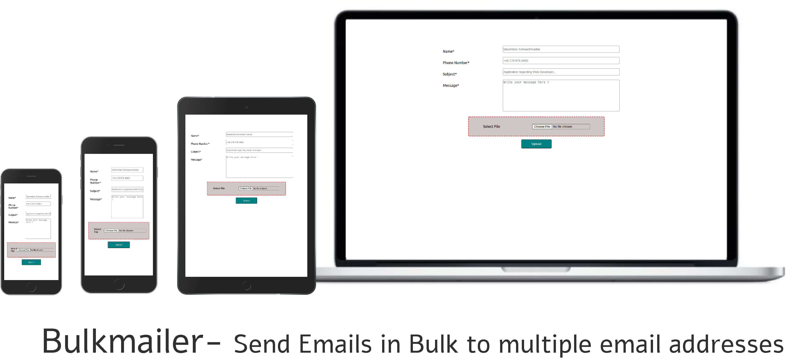

## BulkMailer

This is an web application built using HTML/CSS/JS and some third party libraries/packages for sending emails to multiple email address at once. The emails are to be sent in a performant way. So, the worker threads are used for parsing and sending the emails in an asynchronous manner so that main thread does not get unresponsive and all the load of parsing the email list and sending emails would be taken care of by other worker threads. The inbuilt feature of Papaparse.js is used to enable the worker thread.

To send the emails, this app uses the following packages for setting up connections, parsing emails and sending the emails.
- Express
- NodeMailer
- PapaParse
- Express-handlebars

For the purpose of testing, a free SMTP account is used - Ethereal mail. It is used to test the sending functionality, so that the official email SMTP account doesn't get banned.

## How it Started?

It started as a coding challenge for the interview process of a company (a startup) which did not even check this code upon submitting my entry well before deadline. Yes it is sad, but they had already selected some other candidate, just didn't care enough to inform the remaining candidates. Nevermind, this repo has evolved as a Web-app and wishes to be an SPA (Single Page Application) some day.

There are some requirements for the .csv file containing the multiple email address. 
- The file should contain only email address and no other columns
- The file should not even contain any headers as well. The first line of the .csv file should be an email address.
- Each Email address should be on a new line.
- Duplicate email addresses are allowed for now. The app doesn't check for unique email address. This is the planned feature for now.
- All email addresses should be valid. If the app encounters any invalid email address, it will stop there. This is planned in validations for now.

For the sake of clarity, a sample file named "sample1.csv" is provided in the repository. Simply navigate in the repository path to select the file.

## Usage : To test the app

To test the app, you can clone the app in your computer by executing the following command.

    git clone git@github.com:simarmannsingh/BulkMailer.git

After cloning the app, go inside the directory by executing

    cd BulkMailer/

You need to install all the dependencies so that you can use the app. To do so, execute the following

    npm install

Then after that, to simply test the app, start the app using the command

    npm start

It should run a development server
You can open [http://localhost:3000](http://localhost:3000) to view the running instance of the application in the browser.

Go to the [Ethereal website](https://ethereal.email/login). Enter the email address and password from the app and check the received emails. The default behavior for the app is to send 6 emails per batch.

## How does this actually works?
To explain breifly, a developement server is created to serve the 'express-handlebars' views which renders an html form. On clicking the button, parsecsv() function is called (adding click eventListener was obvious choice but I selected different) which created a worker thread, uploads the .csv file, parses it for email addresses, and for every email address (in a new row) the function creates a post request and sends it to the server on the worker thread. 

## FAQs

1. How can I change the SMTP account setting to use my own SMTP mail account with this app?  
It is not very difficult. Simply make the changes in the app.js file (SMTP settings have been marked with comments) to enter your own SMTP settings. It should work fine. A setup page is planned for now.

2. Can my SMTP mail server get banned for sending bulk emails at once?  
It depends on the plan that you have opted for. Almost all the email providers allow only limited emails to be sent (there is a limit / cap on the emails one can send in an hour) in the free tier exceeding which the email account can surely get banned. But if you are already a premium customer, well enjoy for what you've already paid for. But please don't try if you also have an account with free tier.

3. Can this Web-app be adjusted to allow files to be attached to each email?  
Yes, Surely it can be adjusted. 

4. Is there any other way to achieve the same results?  
There are so many ways. A lot of libraries exists that could be used for parsing .csv files n parts (e.g resumable.js, multer ), for sending emails (nodemailer.js, smtp.js) etc. Any other combination can be used to achieve the same results.

## To-do
- Settings Tab to enter SMTP account settings.
- Parse any .csv file, even with other data columns like name, surname etc.
- Find and remove duplicate email address entries in the .csv file
- Check for valid emails only and skip the invalid email rows.

## Issues
If you happen to find any issues, please use the issues tab and mark them. You can also post suggestion. Any constructive comment, remark is most welcome.